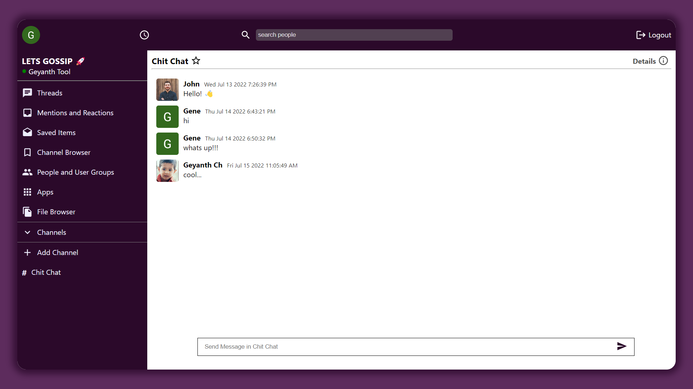

# Let's Gossip

A web application to share your gossips in the form of messages in different channels.

[Live Demo](https://chat-app-940f6.web.app/)

## Screenshots

<div>
    
</div>

## Tech Stack

**Frontend** - ReactJs [🔗](https://reactjs.org/)

**Backend** - Firebase [🔗](https://firebase.google.com/)

**State Management** - Redux (Redux Toolkit - RTK) [🔗](https://redux-toolkit.js.org/)

**Design** - Styled Components [🔗](https://styled-components.com/)

**Icons** - Material UI Icons [🔗](https://mui.com/material-ui/material-icons/)

## Features

- User Authentication (Google Sign In)
- Firebase Firestore to store Messages
- Firebase Hosting to deploy app

_More sign-in methods and complete crud functionality are loading..._

## Environment Variables

To run this project, you will need to add the following environment variables to your .env file. These are the variables
of firebase config object

`REACT_APP_API_KEY`
`REACT_APP_AUTH_DOMAIN`
`REACT_APP_PROJECT_ID`
`REACT_APP_STORAGE_BUCKET`
`REACT_APP_MESSAGING_SENDER_ID`
`REACT_APP_APP_ID`

## Run Locally

Clone the project

```bash
  git clone https://github.com/Geyanth08/Lets_Gossip.git
```

Go to the project directory

```bash
  cd Lets_Gossip
```

Install dependencies

```bash
  npm install
```

_create your environment variables before you start the server_

Start the server

```bash
  npm run start
```

## Deployment using Firebase Hosting

- First set up the project in firebase console and add firebase config object to your firebase.js file

To deploy this project use below documentation 👇

[Firebase Hosting](https://firebase.google.com/docs/hosting)

## See you in my next Build 💖

If you have any feedback, please reach out to me at [linkedin](https://www.linkedin.com/in/geyanth-padmakar-01834a220/)
